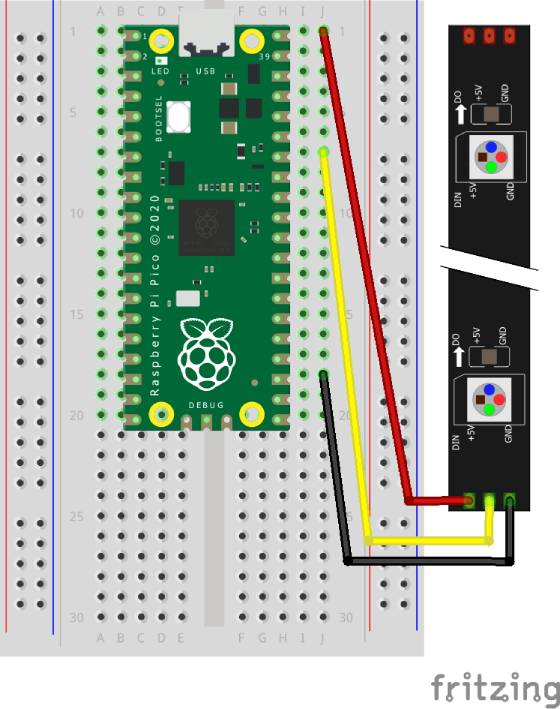

# Neopixels

Using Picozero to control a strip of Neopixels.

## Layout



## Code

``` python
import time
from neopixel import Neopixel
# https://github.com/blaz-r/pi_pico_neopixel

# Kitronik ZIP Stick, 35129 - 5 LEDS
numOfPixels = 5
mode = "GRB"

gpio = 28  # Data In

pixels = Neopixel(numOfPixels, 0, gpio, mode)
  
red = (255, 0, 0)
green = (0, 255, 0)
blue = (0, 0, 255)
yellow = (225, 225, 0)
cyan = (0, 255, 255)
black = (0, 0, 0)  # Fully off
white = (255, 255, 255)  # Fully on

pixels.brightness(25)

colours = [red, yellow, green, cyan, blue]

while True:
    
    # Turn each LED on - various colours
    for index in range(5):
        pixels.set_pixel(index, colours[index])
        pixels.show()
        time.sleep(0.5)
    
    # Rotate right 4 times
    for counter in range(4):
        pixels.rotate_right()
        pixels.show()
        time.sleep(0.5)
    
    # Rotate left 4 times
    for counter in range(4):
        pixels.rotate_left()
        pixels.show()
        time.sleep(0.5)
    
    # Switch LEDs between two colours
    for counter in range(3):
        # Turn all LEDs white (fully on)
        pixels.fill(white)
        pixels.show()
        time.sleep(0.5)
        
        # Turn all LEDs black (fully off)
        pixels.fill(black)
        pixels.show()
        time.sleep(0.5)
        
    # Display a gradient between two colours 
    pixels.set_pixel_line_gradient(0, 4, yellow, red)
    pixels.show()
    time.sleep(1)
    
    # Fill a section
    pixels.set_pixel_line(1, 3, green)
    pixels.show()
    time.sleep(1)
        
    # Turn all LEDs off
    pixels.clear()
    pixels.show()
    time.sleep(1)
```
