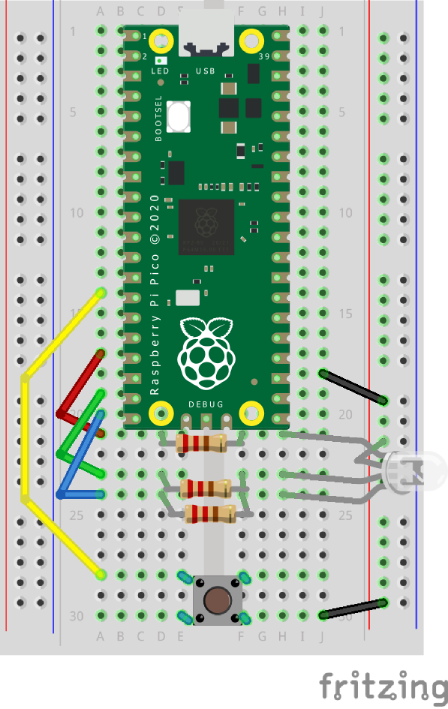

# RGB LED

Using Picozero to to sense a button press to control a RGB LED.

## Layout



## Code

``` python
# Import code
from picozero import Button, RGBLED

# Callback function for button
def next():
    # Use global variable
    global colour
   
    # Increment variable 
    colour = colour + 1
   
    # Check variable value
    if colour == 5:
        # Loop back to the start
        colour = 0

# GPIO pin for button
button = Button(10)

# GPIO pins for RGB LED
rgb = RGBLED(13, 14, 15)

# Declare RGB Colours
black = (0, 0, 0)  # All off
red = (255, 0, 0)
green = (0, 255, 0)
blue = (0, 0, 255)
white = (255, 255, 255)  # All on

# Declare array
colours = [red, green, blue, white, black]

# Declare variable
colour = 0

# Setup button callback
button.when_pressed = next

# Loop forever
while True:
    rgb.color = colours[colour]

```
 
