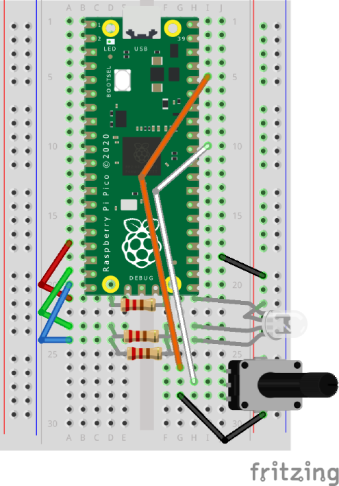

# RGB Potentiometer

Using Picozero to control the brightness of a RGB LED with a potentiometer.

## Layout



## Code

``` python
# Import code
from picozero import Pot, RGBLED
from time import sleep

# For pot reference voltages use:
#   3V3(OUT) (Pin 36)
#   GND (Pin 38)

# GPIO pin for pot reading
dial = Pot(26)  # ADC0

# GPIO pins for RGB LED
rgb = RGBLED(13, 14, 15)

# Loop forever
while True:
    level = int(255 * dial.value)
    rgb.color = (level, level, level)
    sleep(0.1)

```
