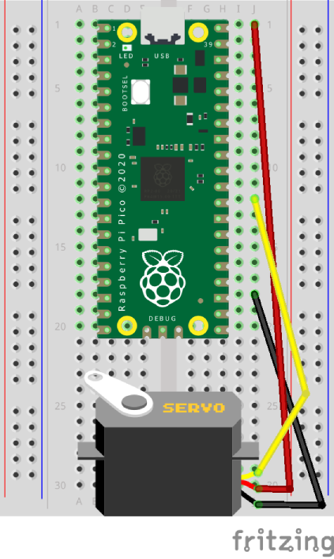

# Servo

Using Picozero to control a servo.

## Layout



## Code

``` python
from picozero import Servo
from time import sleep

# Kitronic Clippable Servo 25105
# Vcc = 5V

servo = Servo(1, min_pulse_width=0.0005, max_pulse_width=0.0025)

# Set the servo to its minimum position
servo.min()
sleep(1)

# Set the servo to its mid position
servo.mid()
sleep(1)

# Set the servo to its maximum position
servo.max()
sleep(1)

# Turn the servo “off” by setting the value to None
servo.off()
```
